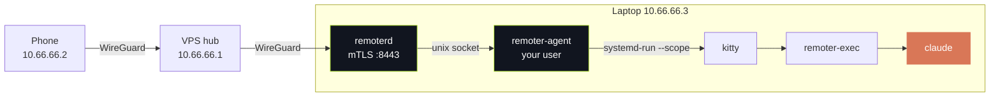

<div align="center">


### Start claude sessions on my laptop from my phone, and pick them up in the Claude app.

<p>
  
  
  
  
  
  
  
  <a href="LICENSE"></a>
</p>

<p>
  <a href="#why">Why</a> &nbsp;·&nbsp;
  <a href="#what-it-does">What it does</a> &nbsp;·&nbsp;
  <a href="#security">Security</a> &nbsp;·&nbsp;
  <a href="#how-it-works">How it works</a> &nbsp;·&nbsp;
  <a href="#install">Install</a> &nbsp;·&nbsp;
  <a href="#build">Build</a>
</p>

</div>

Pick a folder on the laptop from the phone, touch the fingerprint sensor, and a
`claude` Remote Control session comes up there in a few seconds. Then open it in
the Claude app and keep going. **No open ports on the internet, no cloud of my
own, no password.** The phone talks to the laptop over a WireGuard tunnel, and
every action that changes anything is signed by a key that never leaves the
phone's security chip.

---

## Why

Remote Control is great once a session is running. Getting one running still
meant sitting at the laptop: open a terminal, `cd` somewhere, start `claude`,
turn Remote Control on. Half the time I think of the thing I want done when
I'm nowhere near the desk.

So remoter is the missing bit in between. The laptop stays where it is, the
phone browses its folders, and a start is one tap and one finger.

> [!NOTE]
> It's built for exactly one person, one laptop and one phone: Arch, Hyprland,
> kitty, and a Samsung with StrongBox. If your setup is different, expect to
> change things. It's a personal tool first, not a product.

---

## What it does

| | |
| --- | --- |
| **Browse and search** | Walks your home folder over the tunnel. Pin the folders you use, see which ones are git repos and which already have a session running. |
| **Start a session** | In the folder itself, or in its own git worktree so parallel sessions don't trip over each other. Name it, touch the sensor, done. |
| **Watch it come up** | Starting, Ready, Stuck or Exited, read from claude's own debug log rather than guessed from the screen. The last lines of the terminal come along. |
| **Open in Claude** | Ready sessions get a button straight into the Claude app. |
| **Resume** | A folder's past conversations are listed with their title and last prompt. Bring one back as it was, or start fresh from a summary of it. |
| **End it** | One finger, and the window on the laptop goes away with it. |

<div align="center">
  
</div>

Sessions open as kitty windows on Hyprland workspace 9, each in its own systemd
scope, so they don't steal focus and restarting remoter never kills them. If
you're back at the laptop, they're just there.

A folder claude doesn't trust can be trusted from the phone. It says what that
means first (the folder's own Claude settings, hooks and MCP servers get to
run), and the trust rides in the same signed request as the start, so it costs
no extra fingerprint and can't be done without one.

---

## Security

The laptop runs `claude` with bypass permissions, so whoever can start a session
can run anything as me. That decided most of the design.

> [!IMPORTANT]
> Every start, end, mkdir and resume is signed by a P-256 key in the phone's
> StrongBox that needs a fingerprint **per signature**. The laptop checks that
> signature twice: once in the network daemon, and again in the process that
> actually starts sessions, so a compromised network daemon still can't start
> anything.

<div align="center">
  
</div>

- **Pairing** checks Android key attestation against Google's roots: the right
  app, signed by the right cert, on a locked bootloader with a recent patch
  level. It's checked again once a day.
- **The network side** is one daemon with its own user, no home, no internet and
  a tight systemd sandbox. It speaks mTLS 1.3 with pinned keys, and only on the
  tunnel interface.
- **Three bad signatures, or one reused nonce,** lock the laptop side until
  `sudo remoterctl lock off`. Starts are rate limited to three a minute.
- **Everything is logged** to a hash-chained audit log the phone can read.
- **The firewall only touches the tunnel.** LAN, other VPNs and Docker are left
  exactly as they were.

What it doesn't protect against: someone holding your unlocked phone can read
folder names, session output and past prompts. They still can't start or end
anything without your finger.

---

## How it works



- **WireGuard** (`rmt0`). The laptop has no public address, so a cheap VPS is
  the hub. It only forwards between the two peers, and it adds its rules next to
  whatever else the box runs instead of replacing them.
- **remoterd** is the only thing listening. It checks the TLS client, the
  signature and the rate limits, then forwards to the agent.
- **remoter-agent** runs as you. It checks the signature again, guards every
  path against leaving home, and starts sessions.
- **remoter-exec** runs inside the kitty window, starts `claude` and keeps the
  window open after it exits so you can see why.
- **remoterctl** is the admin tool: `init`, `pair`, `devices`, `revoke`,
  `lock on|off`, `log`, `status`, `doctor`.

<details>
<summary><b>The weird parts</b></summary>

<br/>

[docs/notes.md](docs/notes.md) has the things about `claude`, kitty and Hyprland
that the code depends on and that aren't written down anywhere else: which debug
log lines mean ready, how folder trust is inherited (and why claude marks some
folders untrusted on its own), why a second resume of an open conversation has
to be refused by remoter, and why nothing user controlled ever goes on kitty's
command line.

</details>

---

## Install

You need a laptop running a systemd user session with Hyprland and kitty, a VPS
you can ssh into with sudo, and an Android 14+ phone with StrongBox.

1. **The tunnel.** `infra/vps/setup.sh check <host>` looks at the VPS without
   changing anything. Then on the laptop:

   ```bash
   infra/laptop/install-tunnel.sh <host>
   ```

2. **The phone on the tunnel.** This shows a QR for the WireGuard app:

   ```bash
   infra/laptop/phone-tunnel.sh <host>
   ```

3. **The laptop.** It prints every sudo step before running any of them:

   ```bash
   infra/laptop/install.sh --app-cert-sha256 <your release cert digest>
   ```

4. **Pair.** `sudo remoterctl pair --name phone`, scan the code on the phone,
   type the number it shows back on the laptop.

5. **Check.** `remoterctl doctor` should be all green.

> [!TIP]
> `install.sh` is safe to run again. Binaries and units get replaced, but the
> config, the device list and the server key are never overwritten once they
> exist.

---

## Build

The daemons need Rust 1.94+:

```bash
cd daemon
cargo build --release --locked
cargo test --workspace
```

The app needs JDK 17 or newer and an Android SDK with API 36. `android/local.properties`
wants `sdk.dir=/path/to/Android/Sdk`.

```bash
cd android
./gradlew assembleDebug
./gradlew testDebugUnitTest verifyRoborazziDebug
```

Release builds are signed with `android/tools/make-release-key.sh` and
`sign-release.sh`. The key stays out of the repo.

<details>
<summary><b>Tests: 277 Rust + 753 JVM</b></summary>

<br/>

The Rust side covers every rejection path on purpose: forged and replayed
signatures, wrong clocks, an attacker on the LAN routing the tunnel address at
the laptop, a session folder swapped while it starts. `e2e-host` runs the real
daemons against a fake `claude` and a software phone.

The app side covers the view models, the UI, accessibility and 378 Roborazzi
screenshots in light and dark, at 100% and 200% font size.

- Some tests create unix sockets under `daemon/target/tmp`. In a deeply nested
  checkout they fail with `path must be shorter than SUN_LEN`, so clone it
  somewhere short.
- Tests that need root, a real desktop session or the real `claude` are
  `#[ignore]`d.
- `android/tools/run-device-e2e.sh` drives the e2e build of the app on a real
  phone against a staging instance on ports 9443/9444 (`install.sh
  --with-staging`).

</details>

## Known limitations

- Sessions die when Hyprland exits or you log out.
- One laptop, one phone. Pairing a second phone works, but nothing is designed
  around it.
- No CI. The test commands above are run by hand.
- The attestation tests run on Google's published vectors. There's no
  automated test against a chain dumped from my own phone yet.

## Licence

MIT, see [LICENSE](LICENSE). The attestation test vectors in
`daemon/remoter-attest/testdata/keyattestation` come from Google's
keyattestation library and keep their Apache 2.0 licence.

<div align="center">
  <br/>
  <sub>Built because the best ideas show up when the laptop is in another room.</sub>
</div>
