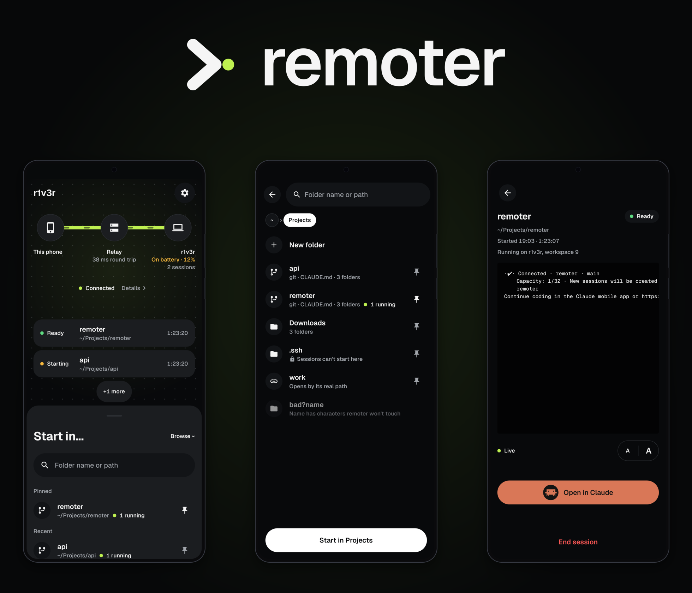
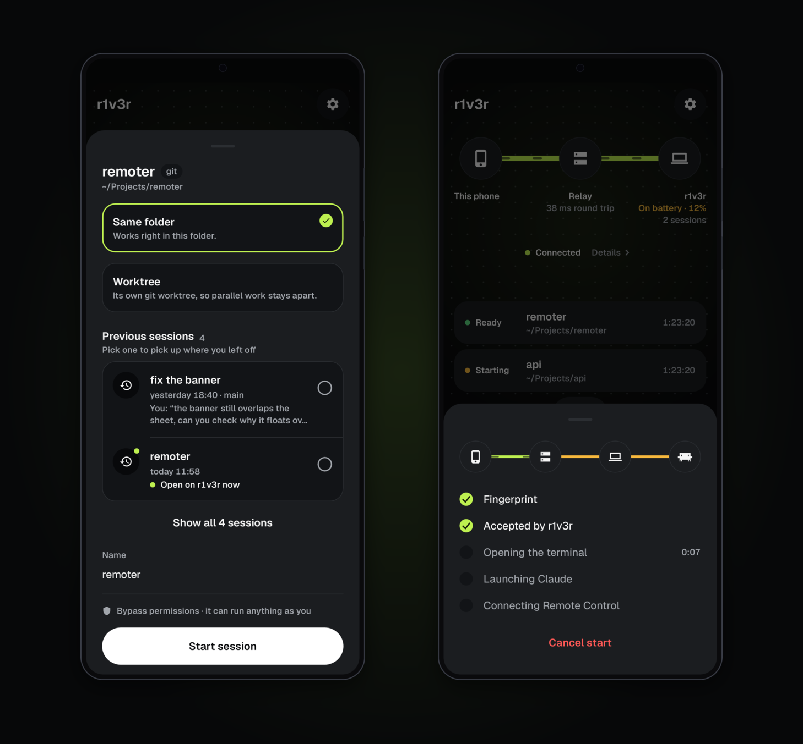
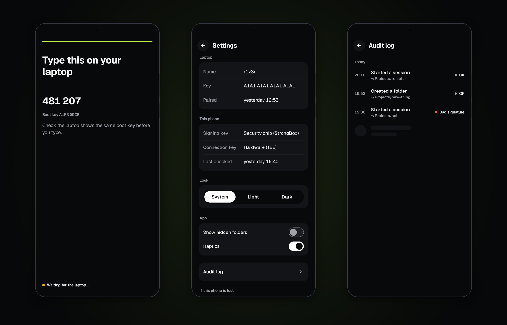
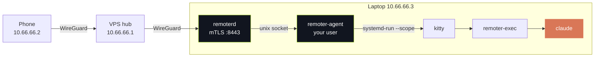

<div align="center">



### Start Claude Code on your laptop from your phone, then carry on in the Claude app.

<p>
  
  
  
  
  
  
  
  <a href="LICENSE"></a>
</p>

<p>
  <a href="#why">Why</a> &nbsp;·&nbsp;
  <a href="#what-it-does">What it does</a> &nbsp;·&nbsp;
  <a href="#security">Security</a> &nbsp;·&nbsp;
  <a href="#how-it-works">How it works</a> &nbsp;·&nbsp;
  <a href="#install">Install</a> &nbsp;·&nbsp;
  <a href="#build">Build</a>
</p>

</div>

Pick a folder on your laptop, touch the fingerprint sensor, and a Claude Code
Remote Control session comes up there a few seconds later. Open it in the Claude
app and keep going. **Nothing open to the internet, no account, no password.**
The phone reaches the laptop over a WireGuard tunnel, and anything that changes
something is signed by a key that never leaves the phone's security chip.

---

## Why

Remote Control is great once a session is running. Getting one running still
meant sitting at the laptop: open a terminal, `cd` somewhere, start `claude`,
turn Remote Control on. And the idea for the next thing usually shows up when
I'm nowhere near the desk.

So I built the missing bit in between. The laptop stays where it is, the phone
browses its folders, and starting a session takes one tap and one finger.

> [!NOTE]
> It grew out of my own setup: Arch, Hyprland, kitty, and a Samsung with
> StrongBox. One laptop, one phone. If yours looks different, expect to change a
> few things. It's a personal tool first, not a polished product.

---

## What it does

| | |
| --- | --- |
| **Browse and search** | Walks your home folder over the tunnel. Pin the folders you use, see which ones are git repos and which already have a session running. |
| **Start a session** | In the folder itself, or in its own git worktree so parallel sessions don't trip over each other. Name it, touch the sensor, done. |
| **Watch it come up** | Starting, Ready, Stuck or Exited, read from Claude Code's own debug log instead of guessed from the screen. You also get the last lines of the terminal. |
| **Open in Claude** | Ready sessions get a button straight into the Claude app. |
| **Resume** | A folder's past conversations are listed with their title and last prompt. Bring one back as it was, or start fresh from a summary of it. |
| **End it** | One finger, and the window on the laptop closes with it. |

<div align="center">
  
</div>

Sessions open as kitty windows on Hyprland workspace 9, each in its own systemd
scope. They don't steal focus, and restarting remoter never kills them. When
you get back to the laptop, they're just there.

Claude Code asks before it works in a folder it doesn't trust, and nobody is at
the laptop to answer. So remoter marks each folder trusted right before it
starts a session there. That means the folder's own Claude settings, hooks and
MCP servers run without asking, so don't start sessions in code you just
downloaded.

---

## Security

Sessions run with bypass permissions, so whoever can start one can run
anything as you. That shaped most of the design.

> [!IMPORTANT]
> Every start, end, mkdir and resume is signed by a P-256 key in the phone's
> StrongBox that needs a fingerprint **per signature**. The laptop checks that
> signature twice, once in the network daemon and again in the process that
> actually starts sessions. Even a compromised network daemon can't start
> anything.

<div align="center">
  
</div>

- **Pairing** checks Android key attestation against Google's roots: the right
  app, signed by the right cert, on a locked bootloader with a recent patch
  level. It's checked again once a day.
- **The network side** is one daemon with its own user, no home, no internet and
  a tight systemd sandbox. It speaks mTLS 1.3 with pinned keys, and only on the
  tunnel interface.
- **Three bad signatures, or one reused nonce,** lock the laptop side until
  `sudo remoterctl lock off`. Starts are rate limited to three a minute.
- **Everything is logged** to a hash-chained audit log the phone can read.
- **The firewall only touches the tunnel.** LAN, other VPNs and Docker are left
  exactly as they were.
- **Sessions stay out of** `.ssh`, `.gnupg`, `.config`, `.claude` and the like,
  and out of your home folder itself. Any other folder in your home gets
  trusted in Claude Code when a session starts there.

What it won't save you from: someone holding your unlocked phone can read
folder names, session output and past prompts. They still can't start or end
anything without your finger.

---

## How it works



- **WireGuard** (`rmt0`). The laptop has no public address, so a cheap VPS is
  the hub. It only forwards between the two peers, and its firewall rules sit
  next to whatever else the box already runs instead of replacing them.
- **remoterd** is the only thing listening. It checks the TLS client, the
  signature and the rate limits, then forwards to the agent.
- **remoter-agent** runs as you. It checks the signature again, guards every
  path against leaving home, and starts sessions.
- **remoter-exec** runs inside the kitty window, starts `claude` and keeps the
  window open after it exits so you can see why.
- **remoterctl** is the admin tool: `init`, `pair`, `devices`, `revoke`,
  `lock on|off`, `log`, `status`, `doctor`.

<details>
<summary><b>The weird parts</b></summary>

<br/>

[docs/notes.md](docs/notes.md) collects the undocumented behaviour of Claude
Code, kitty and Hyprland that the code relies on: which debug log lines mean
ready, why remoter trusts every folder itself instead of relying on Claude
Code's inherited trust, why remoter has to refuse a second resume of an open
conversation, and why nothing you type ever ends up on kitty's command line.

</details>

---

## Install

You need a laptop running a systemd user session with Hyprland and kitty, a VPS
you can ssh into with sudo, and an Android 14+ phone with StrongBox.

1. **The tunnel.** `infra/vps/setup.sh check <host>` looks at the VPS without
   changing anything. Then on the laptop:

   ```bash
   infra/laptop/install-tunnel.sh <host>
   ```

2. **The phone on the tunnel.** This shows a QR for the WireGuard app:

   ```bash
   infra/laptop/phone-tunnel.sh <host>
   ```

3. **The laptop.** It prints every sudo step before running any of them:

   ```bash
   infra/laptop/install.sh --app-cert-sha256 <your release cert digest>
   ```

4. **Pair.** Run `sudo remoterctl pair --name phone`, scan the QR with the app,
   then type the number the phone shows into the laptop.

5. **Check.** `remoterctl doctor` should be all green.

> [!TIP]
> `install.sh` is safe to run again. Binaries and units get replaced, but the
> config, the device list and the server key are never overwritten once they
> exist.

---

## Build

The daemons need Rust 1.94+:

```bash
cd daemon
cargo build --release --locked
cargo test --workspace
```

The app needs JDK 17 or newer and an Android SDK with API 36. `android/local.properties`
wants `sdk.dir=/path/to/Android/Sdk`.

```bash
cd android
./gradlew assembleDebug
./gradlew testDebugUnitTest verifyRoborazziDebug
```

Release builds are signed with `android/tools/make-release-key.sh` and
`sign-release.sh`. The key stays out of the repo.

<details>
<summary><b>Tests: 277 Rust + 753 JVM</b></summary>

<br/>

The Rust tests go after every way a request should be refused: forged and
replayed signatures, skewed clocks, someone on the LAN routing the tunnel address
at the laptop, a folder swapped out while a session starts. `e2e-host` runs the real
daemons against a fake `claude` and a software phone.

The app side covers the view models, the UI, accessibility and 378 Roborazzi
screenshots in light and dark, at 100% and 200% font size.

- Some tests create unix sockets under `daemon/target/tmp`. In a deeply nested
  checkout they fail with `path must be shorter than SUN_LEN`, so clone it
  somewhere short.
- Tests that need root, a real desktop session or the real `claude` are
  `#[ignore]`d.
- `android/tools/run-device-e2e.sh` drives the e2e build of the app on a real
  phone against a staging instance on ports 9443/9444 (`install.sh
  --with-staging`).

</details>

## Known limitations

- Sessions die when Hyprland exits or you log out.
- One laptop, one phone. A second phone can pair, but nothing is designed
  around it.
- No CI. The test commands above are run by hand.
- The attestation tests run on Google's published vectors, not yet on a chain
  from a real phone.

## Licence

MIT, see [LICENSE](LICENSE). The attestation test vectors in
`daemon/remoter-attest/testdata/keyattestation` come from Google's
keyattestation library and keep their Apache 2.0 licence.

<div align="center">
  <br/>
  <sub>Built because the best ideas show up when the laptop is in another room.</sub>
</div>
